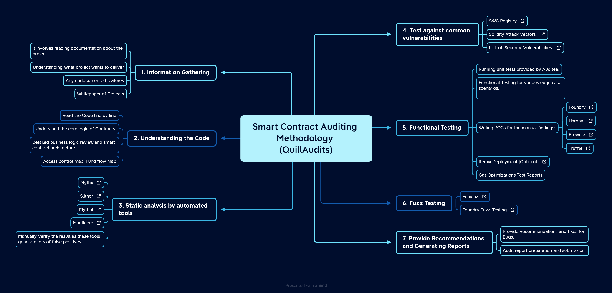

# Smart-contract-Auditing-Methodology-mindmap

PDF Version: [Auditing-Methodology-Mindmap](data/Auditing-methodology-quillaudits.pdf)

Mindmap Link: [https://xmind.works/share/LoZXVn0y](https://xmind.works/share/LoZXVn0y)

## 1. Information Gathering:

1. It involves reading Technical documentation about the project. 
2. Understanding What project wants to deliver
3. Any undocumented features
4. Whitepaper of Projects

## 2. Understanding the Code:

1. Read the Code line by line
2. Understand the core logic of Contracts.
3. Detailed business logic review and smart contract architecture
4. Access control map, Fund flow map

## 3.  Static analysis by automated tools.

1. [Mythx](https://mythx.io/)
2. [Slither](https://github.com/crytic/slither)
3. [Mythril](https://github.com/ConsenSys/mythril)
4. [Manticore](https://github.com/trailofbits/manticore)
5. Manually Verify the result as these tools generate lots of false positives.

## 4. Test against the standard list of vulnerabilities.

1. [SWC Registry](https://swcregistry.io/)
2. [Solidity Attack Vectors](https://github.com/Quillhash/Solidity-Attack-Vectors)
3. [List-of-Security-Vulnerabilities](https://github.com/runtimeverification/verified-smart-contracts/wiki/List-of-Security-Vulnerabilities) 

## 5. Functional Testing:

1. Running unit tests provided by Auditee.
2. Functional Testing for various edge case scenarios.
3. Writing POCs for the manual findings:
    1. [Hardhat](https://hardhat.org/hardhat-runner/docs/getting-started#overview)
    2. [Foundry](https://github.com/foundry-rs/foundry)
    3. [Brownie](https://eth-brownie.readthedocs.io/en/stable/)
    4. [Truffle](https://trufflesuite.com/)
4. [Remix Deployment [Optional]](https://remix.ethereum.org/)
5. Gas Optimizations Test Reports

## 6. F****uzz Testing****

1. [Echidna](https://github.com/crytic/echidna)
2. [Foundry Fuzz-Testing](https://book.getfoundry.sh/forge/fuzz-testing)

## 7. Provide Recommendations and Generating Reports

1. Provide Recommendations and fixes for Bugs.
2. Audit report preparation and Final submission.
